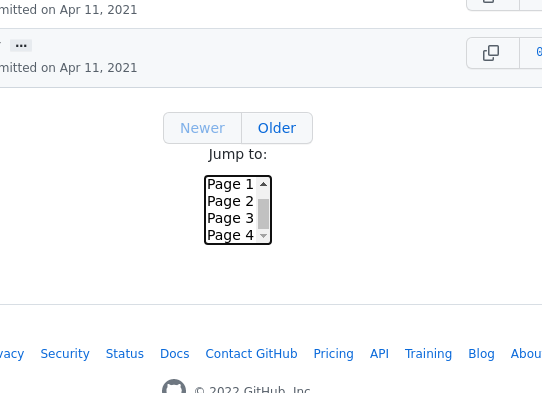

This Tampermonkey script appends a dropdown menu to github.com commit pages (`https://github.com/owner/repo/commits`) to easily jump between pages, such as the first and last pages of the commits list.

